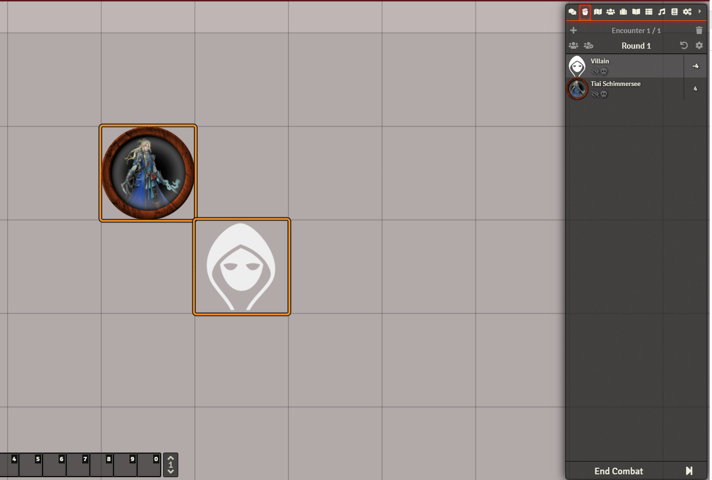

# Splittermond 4 Foundry

## Table of Contents

- License and Used Assets
- Installation
- Screenshots & Features
- How to Build
- Bug Reports
- FAQ

## License and Used Assets

This software implements the Splittermond RPG system published by Uhrwerk Verlag.
It is an *unofficial* implementation by a fan of this RPG system and is in no way related to or approved by the Uhrwerk Verlag.

The art assets used are part of the Splittermond-Fanpaket which requires adding this text visibly to all documents that use it:

````
FOLGENDER TEXT IST GUT SICHTBAR IN JEDEM DOKUMENT ZU PLATZIEREN, DAS MATERIAL AUS DIESEM SPLITTERMOND-FANPAKET VERWENDET.

Impressum
Das Fantasy-Rollenspiel Splittermond wird entworfen und herausgegeben vom Uhrwerk-Verlag.
Bei diesem Fanwerk handelt es sich um inoffizielles Material dazu.

Layout
Daniel Bruxmeier
basierend auf Grafiken von

Brenda Clarke (http://inadesign-stock.deviantart.com/art/Moody-Blues-Texture-Pack-1-261617011),
Bethany Lerie (http://redlillith.deviantart.com/art/misc-tribal-brushes-14070868),
Alex Ruiz (http://alexruizart.deviantart.com/art/Tribal-Tech-Photoshop-Brushes-414404973),
Carsten Jünger (http://pixelmixtur-stocks.deviantart.com/art/Wood-Texture-418149743)

Dieses Layout steht unter folgender Creative Commons-Lizenz: CC BY 4.0 (http://creativecommons.org/licenses/by/4.0/deed.de)
Dies umfasst ausdrücklich nicht die eigentlichen Inhalte des Dokuments wie Texte oder zusätzliche Illustrationen.
Bei Nutzung dieses Layouts bitte wenn möglich das endgültige Werk ebenfalls unter eine Creative Commons-Lizenz stellen.
````

## Installation
Install in Foundry using this link:
https://raw.githubusercontent.com/Naresea/splittermond4foundry/naresea/splittermond-nx/package/system.json


## Screenshots and Features

### Character Sheet

Some screenshots of the character sheet.
First is after creating a new character (and setting a portrait image):


Attributes page:


Skills:


Adding weapons (skills aka "fertigkeit" is matched by name to allow for homebrew skills):


### Modifier system
Almost all items have a "modifier" tab or similar that allows adding generic modifiers to
attributes, skills, tick time and wound levels.
The following screenshots show adding a Merkmal "Schwächlich" that reduces the wound levels by 2.


When we change the wound levels by "-2", the HP are reduced accordingly.
(24 instead of 40 without the modifier)


Some screenshots of the modifiers menu:


Matching skills by name:


### Combat Integration
The system modifies Foundry's default combat sheet to sort combatants in ascending order.
So the person with the smallest value in "initiative" (ticks) is on top and active.
When moving to the next "turn", a dialog opens asking for the amount of ticks to be added.
Or removed, if you add a negative number.




The system also provides a helper function for macros to quickly change the initiative
of the selected token(s). This way it should be easy to implemnt things like Attack of Opportunity,
active defense etc. By default the function will open the same dialog as the combat system,
but you can also provide a tick number right away by calling "game.splittermond.macroHelpers.changeInitiative(\<ticks>)"


### Skill Rolls, Weapon Rolls, etc

By default if something is rollable, you will see a D20 icon next to it.
Splittermond doesn't use a D20, but D10 icons are a professional grade feature of Fontawesome and would cost money.
Clicking that D20 icon will open a dialog where you can choose how you want to roll and add additional modifiers for e.g.
tactical advantages, shooting with ranged into melee, darkness etc.

As the dialog tells you, it's possible to omit this dialog by using "[ALT] + Click" for a normal roll,
"[ALT] + [SHIFT] + Click" for a risk roll and "[ALT] + [CTRL] + Click" for a safety roll.

Maybe it helps to remember the shortcuts: [ALT] alters the behavior, [SHIFT] dials up the volume at risk of sounding
angry in written messages and [CTRL] helps you stay in control.... at least that's why I decided on these mappings.


Roll results are formatted in the Chat as usual, with some extra benefits like directly rolling damage,
increasing the ticks of the rolling actor in the active combat encounter or reducing the fokus after casting a spell.

Some rolls also come with "Explanation"-Labels on which you can click and see detailed info on the calculations
the system did.


## How to Build
Setup the following variables in a "foundryconfig.json" next to this Readme:
````
{
  "dataPath": "path/to/your/foundry/data/folder",
  "repository": "",
  "rawURL": ""
}
````

Run this script in a bash-like environment (e.g. Git-Bash under windows):
npm i && npm run build

If the "link" step fails under Windows, please make sure you have "Development Mode" enabled in your Windows Settings.
Otherwise Window's won't allow creation of symlinks and you'll have to copy the files in the "dist" folder manually.

## Bug Reports

Please use the Github bug tracker to inform me about bugs, and follow this format (just copy & paste it):

````
I'm submitting a (check one)

[ ] Feature Request
[ ] Bug Report

The feature / bug (check all that apply)

[ ] makes the system unusable for me
[ ] leads to loss of data in the world
[ ] degrades performance
[ ] can be fixed by the user (e.g. refreshing the page, deleting the chat log, etc)

What I did when the bug happened:

What I noticed fixes the behavior:

What I'd like as feature:

How you can reach me if you need more details (optional):

````

## FAQ

- if initiative rolls result in "0", no value is displayed in the combat tracker
-> JS unfortunately interprets 0 as "false value", which keeps Foundry from rendering this.
Fixing this is on my TODO list, but not the most important thing.

- performance drops when rolling a lot
-> Not exactly a known issue, more an anticipation. Since each rolled chat message contains event
listeners for the buttons I guess performance might drop on longer chat logs than I tested.
Cleaning the chat log or deleting old messages should fix that again.

- The item lists look monotonous.
-> Right, but the standardized look was the fastest way to implement things.
I'll try to improve the look and feel.

- The skill list is astronomically long.
-> I want to split it up into combat, general, and magic skills in the future

- Combat skills require attributes?
-> They do, but the attributes aren't evaluated since weapon rolls are linked to the weapon you use

- Consumable items are not "usable"
-> I want to add a "use" button similar to the rolls eventually.
That's the reason for the details fields

- There's no compendium content
-> I hope there will be at some point. :) I don't know how much of the rulebooks I am allowed to provide as compendium, though.

- "Ausbildung", "Abstammung", "Kultur", etc provide modifiers?
-> Yes. I want to add an option to include the skill increases, strengths, masteries etc. in these items so
eventually you only have to drag & drop them on a character to apply the associated changes

- The portrait icon sucks.
-> I know... it works for some portraits, for others you have to tweak the image a bit.
Eventually I want to add a "journal" tab that displays the full image and where you can keep records
on how you earned money, XP etc. When I'm there I'll change the portrait field to display the token, which
should be a far better fit.
